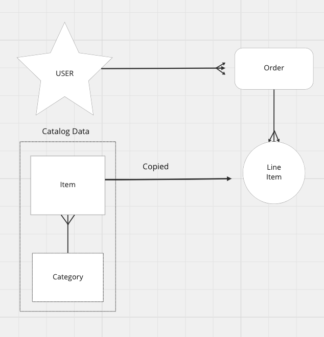
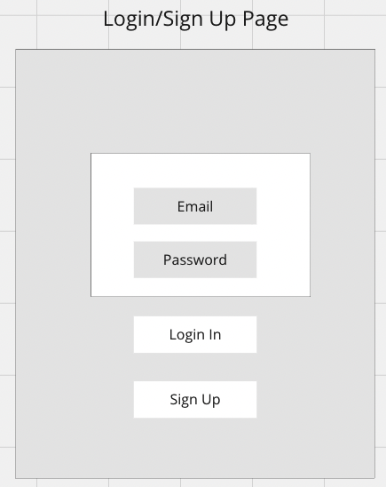
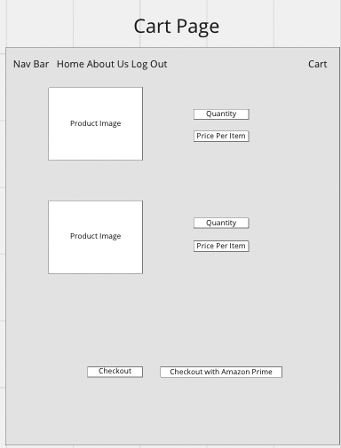

# Holiday Spirit

## Background:
	- A mern-stack single page application for my own holiday clothing products

## Trello:

## AAU:
	- AAU I want to be able to add items to cart
	- AAU I want to be able to update the quantity of item
	- AAU I want to be able I want to be able to check out with Amazon prime 
	- AAU login in or sign up to access store 
	
## ERD: 

## Wireframes:

 

## Technologies Used: 
	- React
  	- JWT
	- MongoDB
	- Mongoose
	- Express JS
	- Node JS
	- HTML5
	- CSS & Bootstrap, ReactStrap 
	- JavaScript

## Next Steps: 
	- Implement Stripe API to accept payment directly on site. 